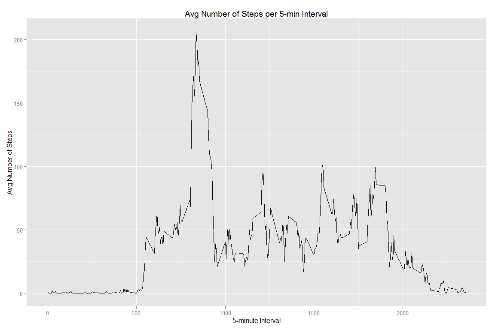
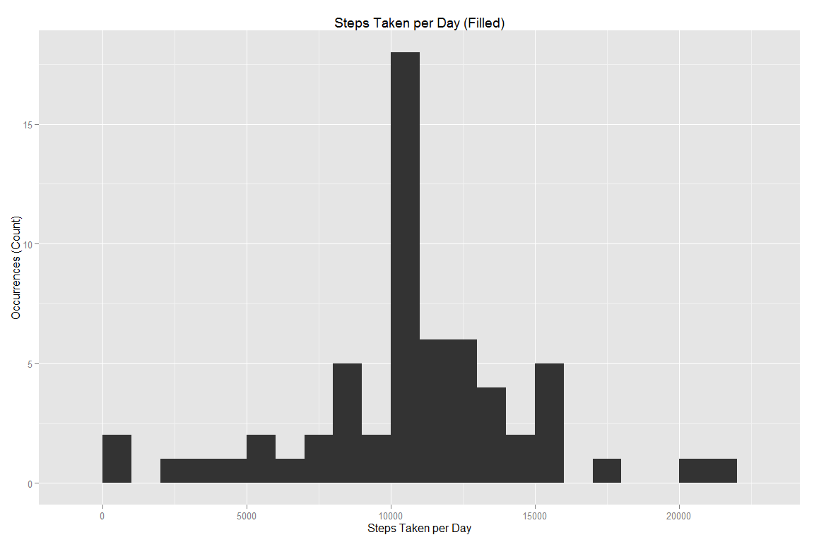
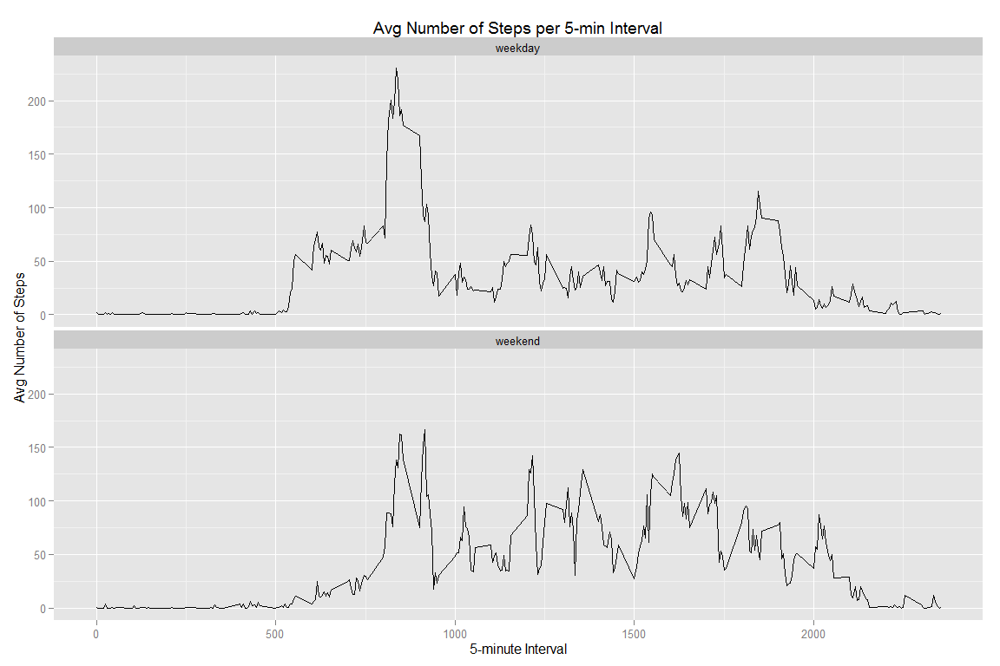

#Reproducible Research
###Peer Assessment 1: PA1_template


###Introduction
This document presents the results of Peer Assessment 1 for the Coursera course: Reproducible Research. This assessment required the student to create a R markdown document which answers questions related to a prescribed dataset. The R markdown document is to then be processed by knitr and transformed into an HTML file.


###Data
This assignment makes use of data from a personal activity monitoring device. This device collects data at 5 minute intervals through out the day. The data consists of two months of data from an anonymous individual collected during the months of October and November, 2012 and include the number of steps taken in 5 minute intervals each day.

* Dataset: [Activity monitoring data](https://d396qusza40orc.cloudfront.net/repdata%2Fdata%2Factivity.zip) [52K]

The variables included in this dataset are:

* **steps**: Number of steps taking in a 5-minute interval (missing values are coded as `NA`)

* **date**: The date on which the measurement was taken in YYYY-MM-DD format

* **interval**: Identifier for the 5-minute interval in which measurement was taken

The dataset is stored in a comma-separated-value (CSV) file with a total 17,568 observations.


###Loading and preprocessing the data

```r
for (package in c('ggplot2')) {
 
    if (!require(package, character.only = TRUE, quietly = FALSE)) {
        install.packages(package)
        library(package, character.only = TRUE)
    }
}

val_dfpath <- paste(getwd(), "data", sep = "/")
val_dfname <- "activity.csv"
val_dfdlink <- "http://d396qusza40orc.cloudfront.net/repdata%2Fdata%2Factivity.zip"

if(file.exists(paste(val_dfpath, val_dfname, sep = "/")) == FALSE){
    
  tryCatch({
      
    temp_data <- tempfile()
    download.file(val_dfdlink, temp_data)
    dir.create(val_dfpath)
    unzip(temp_data, exdir = val_dfpath)
    unlink(temp_data, force = TRUE)
    rm(temp_data)
      
  }, error = function(e){
      
    stop("Datafile error")
      
  })
    
}

data_activity <- read.csv(paste(val_dfpath, val_dfname[1], sep = "/"))

data_activity$date <- as.Date(data_activity$date, format = "%Y-%m-%d")
data_activity$interval <- as.integer(data_activity$interval)
```


###Question 1: What is mean total number of steps taken per day?
####Subset and plot relevant data:

```r
data_stepspday <- aggregate(x = list(steps = data_activity$steps), by = list(interval = data_activity$date), FUN = sum, na.rm = TRUE)

ggplot(data = data_stepspday, aes(x = steps)) + 
  geom_histogram(binwidth = 1000) + 
  labs(title = "Steps Taken per Day", x = "Steps Taken per Day", y = "Occurrences (Count)")
```

 

####Mean/Median (With NA's):

```r
mean(data_stepspday$steps)
```

```
## [1] 9354.23
```

```r
median(data_stepspday$steps)
```

```
## [1] 10395
```


###Question 2: What is the average daily activity pattern?
####Subset and plot relevant data:

```r
data_stepspint <- aggregate(x = list(steps = data_activity$steps), by = list(interval = data_activity$interval), FUN = mean, na.rm = TRUE)

ggplot(data = data_stepspint, aes(x = interval, y = steps)) +
  geom_line() +
  labs(title = "Avg Number of Steps per 5-min Interval", x = "5-minute Interval", y = "Avg Number of Steps")
```

 

####Maximum Steps-Interval:

```r
data_stepspint[which.max(data_stepspint$steps),]
```

```
##     interval    steps
## 104      835 206.1698
```


###Question 3: Imputing missing values
####Count of NA values:

```r
val_missing <- is.na(data_activity$steps)

table(val_missing)
```

```
## val_missing
## FALSE  TRUE 
## 15264  2304
```

####Replace NA values with mean:

```r
func_fillval <- function(steps, interval) {
  
  val_filled <- NA
  
  if (!is.na(steps))
    
    val_filled <- c(steps)
  
  else
    
    val_filled <- (data_stepspint[data_stepspint$interval == interval, "steps"])
  
  return(val_filled)
  
}

data_activityfilled <- data_activity
data_activityfilled$steps <- mapply(func_fillval, data_activityfilled$steps, data_activityfilled$interval)
```

####Subset and plot relevant data:

```r
data_stepspdayfilled <- aggregate(x = list(steps = data_activityfilled$steps), by = list(interval = data_activityfilled$date), FUN = sum, na.rm = TRUE)

ggplot(data = data_stepspdayfilled, aes(x = steps)) + 
  geom_histogram(binwidth = 1000) + 
  labs(title = "Steps Taken per Day (Filled)", x = "Steps Taken per Day", y = "Occurrences (Count)")
```

 

####Mean/Median (With NA's):

```r
mean(data_stepspday$steps)
```

```
## [1] 9354.23
```

```r
median(data_stepspday$steps)
```

```
## [1] 10395
```

####Mean/Median (Without NA's):

```r
mean(data_stepspdayfilled$steps)
```

```
## [1] 10766.19
```

```r
median(data_stepspdayfilled$steps)
```

```
## [1] 10766.19
```

The mean and the median are approximately equal after replacing missing values with the mean value for the relevant interval.


###Question 4: Are there differences in activity patterns between weekdays and weekends?
####Identify and label occurrences by weekday/weekend:

```r
func_weekdayend <- function(date) {
  
  val_day <- weekdays(date)
  
  if (val_day %in% c("Monday", "Tuesday", "Wednesday", "Thursday", "Friday"))
    
    return("weekday")
  
  else if (val_day %in% c("Saturday", "Sunday"))
    
    return("weekend")
  
  else
    
    stop("func_weekdayend: Error")

}

data_activityfilled$day <- sapply(data_activityfilled$date, FUN = func_weekdayend)
```

####Subset and plot relevant data:

```r
data_stepspintdays <- aggregate(x = list(steps = data_activityfilled$steps), by = list(interval = data_activityfilled$interval, day = data_activityfilled$day), FUN = mean, na.rm = TRUE)

ggplot(data = data_stepspintdays, aes(x = interval, y = steps)) +
  geom_line() +
  facet_wrap(~ day, nrow = 2, ncol = 1) +
  labs(title = "Avg Number of Steps per 5-min Interval", x = "5-minute Interval", y = "Avg Number of Steps")
```

 
