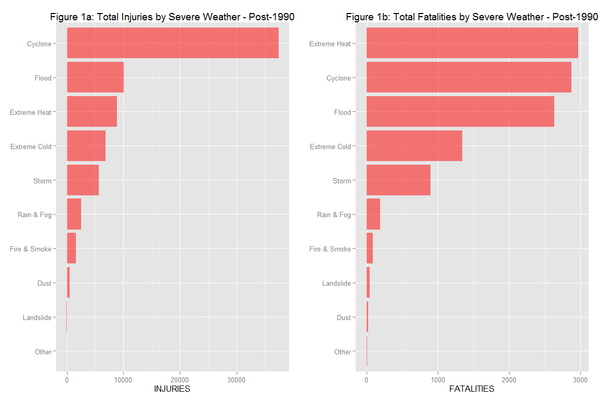
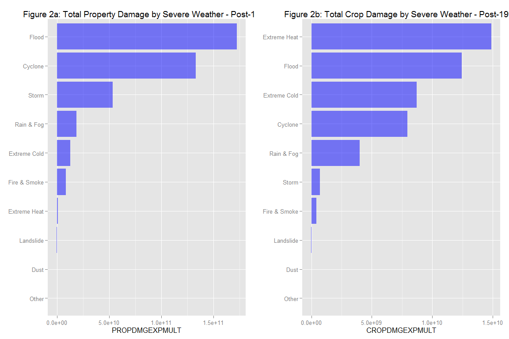

#Reproducible Research
###Peer Assessment 2: PA2_template


###Introduction
This document presents the results of Peer Assessment 2 for the Coursera course: Reproducible Research. This assessment required the student to explore the NOAA Storm Database and answer some basic questions about severe weather events.

The student must use the database to answer the questions below and show code for your entire analysis.
1. Across the United States, which types of events are most harmful with respect to population health?
2. Across the United States, which types of events have the greatest economic consequences?


###Data
This assignment makes use of data from the National Weather Service Storm Database in the form of a comma-separated-value file compressed via the bzip2 algorithm. The events in the database start in the year 1950 and end in November 2011. In the earlier years of the database there are generally fewer events recorded, most likely due to a lack of good records. More recent years should be considered more complete.

* Dataset: [storm data](https://d396qusza40orc.cloudfront.net/repdata%2Fdata%2FStormData.csv.bz2)

It consists of 902,297 observations on 37 variables.


###1. Loading Packages/ Data

```r
for (package in c('ggplot2', 'dplyr', 'gridExtra')) {
 
    if (!require(package, character.only = TRUE, quietly = FALSE)) {
        install.packages(package)
        library(package, character.only = TRUE)
    }
}

remove(package)

val_dfpath <- paste(getwd(), "data", sep = "/")
val_dfname <- "repdata_data_StormData.csv.bz2"
val_dfdlink <- "http://d396qusza40orc.cloudfront.net/repdata%2Fdata%2FStormData.csv.bz2"

tryCatch({

  if (exists("data_storm.raw") == FALSE) {
 
    if (file.exists(paste(val_dfpath, val_dfname, sep = "/")) == FALSE) {
       
      dir.create(val_dfpath)
      download.file(val_dfdlink, paste(val_dfpath, val_dfname, sep = "/"))
       
    }
     
    temp_bzfile <- bzfile(paste(val_dfpath, val_dfname, sep = "/"), "r")
    data_storm.raw <- read.csv(temp_bzfile, stringsAsFactors = FALSE)
 
  }
      
}, error = function(e){
      
  stop("Datafile error")
      
})

remove(val_dfpath, val_dfname, val_dfdlink, temp_bzfile)
```


###2. Pre-process the Data
Retrieve columns of interest:

```r
val_stormcol <- c("BGN_DATE", "EVTYPE", "FATALITIES", "INJURIES",  "PROPDMG", "PROPDMGEXP", "CROPDMG", "CROPDMGEXP")

data_storm.sub <- data_storm.raw[, val_stormcol]

remove(val_stormcol)
```

Group related 'EVTYPE' records and store within new 'SOURCE' column:

```r
data_storm.sub$SOURCE <- NA

data_storm.sub[grepl("precipitation|rain|hail|drizzle|wet|percip|burst|depression|fog|wall cloud",
  data_storm.sub$EVTYPE, ignore.case = TRUE), "SOURCE"] <- "Rain & Fog"
data_storm.sub[grepl("storm|thunderstorm|lightning",
  data_storm.sub$EVTYPE, ignore.case = TRUE), "SOURCE"] <- "Storm"
data_storm.sub[grepl("wind|wnd|hurricane|tornado|tstm|typhoon|spout|funnel|whirlwind",
  data_storm.sub$EVTYPE, ignore.case = TRUE), "SOURCE"] <- "Cyclone"
data_storm.sub[grepl("slide|erosion|slump",
  data_storm.sub$EVTYPE, ignore.case = TRUE), "SOURCE"] <- "Landslide"
data_storm.sub[grepl("warmth|warm|heat|dry|hot|drought|thermia|temperature record|record temperature|record high",
  data_storm.sub$EVTYPE, ignore.case = TRUE), "SOURCE"] <- "Extreme Heat"
data_storm.sub[grepl("cold|cool|ice|icy|frost|freeze|snow|winter|wintry|wintery|blizzard|chill|freezing|avalanche|glaze|sleet",
  data_storm.sub$EVTYPE, ignore.case = TRUE), "SOURCE"] <- "Extreme Cold"
data_storm.sub[grepl("flood|surf|blow-out|swells|fld|dam break|seas|high water|tide|tsunami|wave|current|marine|drowning",
  data_storm.sub$EVTYPE, ignore.case = TRUE), "SOURCE"] <- "Flood"
data_storm.sub[grepl("dust|saharan",
  data_storm.sub$EVTYPE, ignore.case = TRUE), "SOURCE"] <- "Dust"
data_storm.sub[grepl("fire|smoke|volcanic",
  data_storm.sub$EVTYPE, ignore.case = TRUE), "SOURCE"] <- "Fire & Smoke"

data_storm.sub$SOURCE[is.na(data_storm.sub$SOURCE)] <- "Other"

##data_storm.sub <- group_by(data_storm.sub, SOURCE)
```

Derive total property and crop damage expense:

```r
data_storm.sub$PROPDMGMULT <- NA

data_storm.sub[grepl("",
  data_storm.sub$PROPDMGEXP, ignore.case = TRUE), "PROPDMGMULT"] <- 0
data_storm.sub[grepl("H",
  data_storm.sub$PROPDMGEXP, ignore.case = TRUE), "PROPDMGMULT"] <- 100
data_storm.sub[grepl("K",
  data_storm.sub$PROPDMGEXP, ignore.case = TRUE), "PROPDMGMULT"] <- 1000
data_storm.sub[grepl("M",
  data_storm.sub$PROPDMGEXP, ignore.case = TRUE), "PROPDMGMULT"] <- 1000000
data_storm.sub[grepl("B",
  data_storm.sub$PROPDMGEXP, ignore.case = TRUE), "PROPDMGMULT"] <- 1000000000

data_storm.sub$PROPDMGEXPMULT <- data_storm.sub$PROPDMG * data_storm.sub$PROPDMGMULT

data_storm.sub$CROPDMGMULT <- NA

data_storm.sub[grepl("",
  data_storm.sub$CROPDMGEXP, ignore.case = TRUE), "CROPDMGMULT"] <- 0
data_storm.sub[grepl("H",
  data_storm.sub$CROPDMGEXP, ignore.case = TRUE), "CROPDMGMULT"] <- 100
data_storm.sub[grepl("K",
  data_storm.sub$CROPDMGEXP, ignore.case = TRUE), "CROPDMGMULT"] <- 1000
data_storm.sub[grepl("M",
  data_storm.sub$CROPDMGEXP, ignore.case = TRUE), "CROPDMGMULT"] <- 1000000
data_storm.sub[grepl("B",
  data_storm.sub$CROPDMGEXP, ignore.case = TRUE), "CROPDMGMULT"] <- 1000000000

data_storm.sub$CROPDMGEXPMULT <- data_storm.sub$CROPDMG * data_storm.sub$CROPDMGMULT
```

Combine 'INJURIES' and 'FATALITIES', as well as 'PROPDMGEXP' and 'CROPDMGEXP':

```r
data_storm.sub <- mutate(data_storm.sub, CASUALTIES = INJURIES + FATALITIES)
data_storm.sub <- mutate(data_storm.sub, DMGEXPMULT = PROPDMGEXPMULT + CROPDMGEXPMULT)
```

Identify records by year and subset pre/post-1990 data (hidden due to assessment plot limit):

```r
data_storm.sub <- data.frame(data_storm.sub[1],
  YEAR = as.numeric(format(as.Date(data_storm.sub[, 1], format = "%m/%d/%Y %H:%M:%S"), "%Y")),
  data_storm.sub[2:ncol(data_storm.sub)])

val_recordbyyear <- ggplot(data = data_storm.sub, aes(x = YEAR)) +
  geom_histogram(binwidth = 0.1, col = "black", alpha = 0.5) +
  geom_vline(xintercept = 1990, color = "red") +
  ggtitle("Figure x: Observations by Year")
  
data_storm.sub.inc1 <- data_storm.sub[data_storm.sub$YEAR < 1990, ]
data_storm.sub.inc2 <- data_storm.sub[data_storm.sub$YEAR >= 1990, ]
```


###3. Exploratory Data Analysis
Conduct summary statistics on 'INJURIES' and 'FATALITIES', store in new dataframe:

```r
data_storm.sum1.inc1 <- aggregate(INJURIES ~ SOURCE, data = data_storm.sub.inc1, FUN = sum)
data_storm.sum1.inc2 <- aggregate(INJURIES ~ SOURCE, data = data_storm.sub.inc2, FUN = sum)

data_storm.sum2.inc1 <- aggregate(FATALITIES ~ SOURCE, data = data_storm.sub.inc1, FUN = sum)
data_storm.sum2.inc2 <- aggregate(FATALITIES ~ SOURCE, data = data_storm.sub.inc2, FUN = sum)

data_storm.sum1.inc1 <- arrange(data_storm.sum1.inc1, -INJURIES)
data_storm.sum1.inc2 <- arrange(data_storm.sum1.inc2, -INJURIES)

data_storm.sum2.inc1 <- arrange(data_storm.sum2.inc1, -FATALITIES)
data_storm.sum2.inc2 <- arrange(data_storm.sum2.inc2, -FATALITIES)
```

Plot post-1990, injury/fatality data:

```r
val_storminc2plot1  <- ggplot(data_storm.sum1.inc2, aes(x = reorder(SOURCE, INJURIES), y = INJURIES)) +
  geom_bar(stat = "identity", fill = "red", alpha = 0.5) +
  coord_flip() +
  ggtitle("Figure 1a: Total Injuries by Severe Weather - Post-1990") +
  theme(axis.title.y = element_blank())

val_storminc2plot2  <- ggplot(data_storm.sum2.inc2, aes(x = reorder(SOURCE, FATALITIES), y = FATALITIES)) +
  geom_bar(stat = "identity", fill = "red", alpha = 0.5) +
  coord_flip() +
  ggtitle("Figure 1b: Total Fatalities by Severe Weather - Post-1990") +
  theme(axis.title.y = element_blank())

grid.arrange(val_storminc2plot1, val_storminc2plot2, ncol = 2)
```

 
Plot shows that 'Cyclone' category events have caused the most injuries post-1990. 'Extreme Heat' events have caused the most fatalities post-1990.


Conduct summary statistics on cyclone related 'CASUALTIES' and store in new dataframe:

```r
data_storm.sub.inc2.cyc <- data_storm.sub.inc2[grep("Cyclone", data_storm.sub.inc2$SOURCE, perl = TRUE), ]

data_storm.sum.inc2.cyc <- aggregate(CASUALTIES ~ EVTYPE, data = data_storm.sub.inc2.cyc, FUN = sum)

data_storm.sum.inc2.cyc <- arrange(data_storm.sum.inc2.cyc, -CASUALTIES)

data_storm.sum.inc2.cyc <- head(data_storm.sum.inc2.cyc, 10)
```

Plot post-1990 tornado related 'CASUALTIES' (hidden due to assessment plot limit):

```r
val_post90casualties <- ggplot(data_storm.sum.inc2.cyc, aes(x = reorder(EVTYPE, CASUALTIES), y = CASUALTIES)) +
  geom_bar(stat = "identity", fill = "red", alpha = 0.5) +
  coord_flip() +
  ggtitle("Figure x: Total Tornado Related Casualties - Post-1990") +
  theme(axis.title.y = element_blank())
```

Conduct summary statistics on 'PROPDMGEXP' and 'CROPDMGEXP', store in new dataframe:

```r
data_storm.sum3.inc1 <- aggregate(PROPDMGEXPMULT ~ SOURCE, data = data_storm.sub.inc1, FUN = sum)
data_storm.sum3.inc2 <- aggregate(PROPDMGEXPMULT ~ SOURCE, data = data_storm.sub.inc2, FUN = sum)

data_storm.sum4.inc1 <- aggregate(CROPDMGEXPMULT ~ SOURCE, data = data_storm.sub.inc1, FUN = sum)
data_storm.sum4.inc2 <- aggregate(CROPDMGEXPMULT ~ SOURCE, data = data_storm.sub.inc2, FUN = sum)

data_storm.sum3.inc1 <- arrange(data_storm.sum3.inc1, -PROPDMGEXPMULT)
data_storm.sum3.inc2 <- arrange(data_storm.sum3.inc2, -PROPDMGEXPMULT)

data_storm.sum4.inc1 <- arrange(data_storm.sum4.inc1, -CROPDMGEXPMULT)
data_storm.sum4.inc2 <- arrange(data_storm.sum4.inc2, -CROPDMGEXPMULT)
```

Plot post-1990, property/crop damage expense data:

```r
val_storminc2plot1  <- ggplot(data_storm.sum3.inc2, aes(x = reorder(SOURCE, PROPDMGEXPMULT), y = PROPDMGEXPMULT)) +
  geom_bar(stat = "identity", fill = "blue", alpha = 0.5) +
  coord_flip() +
  ggtitle("Figure 2a: Total Property Damage by Severe Weather - Post-1990") +
  theme(axis.title.y = element_blank())

val_storminc2plot2  <- ggplot(data_storm.sum4.inc2, aes(x = reorder(SOURCE, CROPDMGEXPMULT), y = CROPDMGEXPMULT)) +
  geom_bar(stat = "identity", fill = "blue", alpha = 0.5) +
  coord_flip() +
  ggtitle("Figure 2b: Total Crop Damage by Severe Weather - Post-1990") +
  theme(axis.title.y = element_blank())

grid.arrange(val_storminc2plot1, val_storminc2plot2, ncol = 2)
```

 
Plot shows that 'Flood' category events have caused the most property damage post-1990. 'Extreme Heat' events have caused the most crop damage post-1990.


Conduct summary statistics on 'DMGEXP' and store in new dataframe:

```r
data_storm.sub.inc2.flood <- data_storm.sub.inc2[grep("Flood", data_storm.sub.inc2$SOURCE, perl = TRUE), ]

data_storm.sum.inc2.flood <- aggregate(DMGEXPMULT ~ EVTYPE, data = data_storm.sub.inc2.flood, FUN = sum)

data_storm.sum.inc2.flood <- arrange(data_storm.sum.inc2.flood, -DMGEXPMULT)

data_storm.sum.inc2.flood <- head(data_storm.sum.inc2.flood, 10)
```

Plot post-1990 flood related 'DMGEXP' (hidden due to assessment plot limit):

```r
val_post90flood <- ggplot(data_storm.sum.inc2.flood, aes(x = reorder(EVTYPE, DMGEXPMULT), y = DMGEXPMULT)) +
  geom_bar(stat = "identity", fill = "blue", alpha = 0.5) +
  coord_flip() +
  ggtitle("Figure x: Total Damage by Severe Weather - Post-1990") +
  theme(axis.title.y = element_blank())
```
