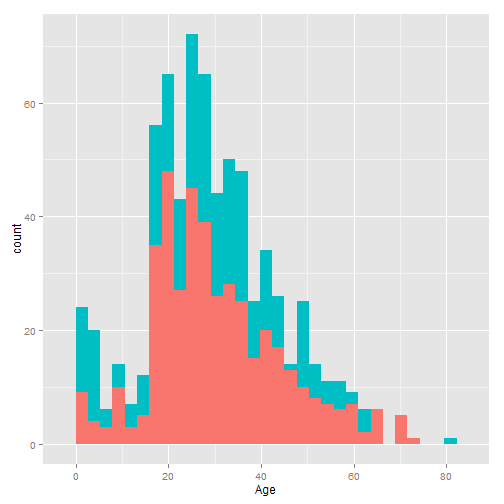

---
title       : Coursera Developing Data Products
subtitle    : Reproducible Pitch Presentation
author      : Darryl Buswell (www.github.com/buswedg)
framework   : io2012                        # {io2012, html5slides, shower, dzslides, ...}
hitheme     : tomorrow                      #
widgets     : [mathjax, quiz, bootstrap]    # {mathjax, quiz, bootstrap}
mode        : selfcontained                 # {standalone, draft}
--- .class #id


# Some Background
___

### What's exploratory data analysis?

Exploratory data analysis involves summarizing and analyzing data at a high level, often using visual methods. When employed correctly, it is able to give the analyst a 'sense' of the data characteristics and relationships, improving flow-on analysis throughout the data analysis pipeline.</p>

### What's the problem?

Exploratory analysis doesn't generate the same sort of titillation as other methods in the data scientist's toolbox (looking at you machine learning). It is often viewed as a tedious exercise that is low-value add.

### What's the solution?

Cut down on the manual effort involved for exploratory analysis with a web application which can import raw datasets and automate the charting process...

--- .class #id

# The Web Application
___

### What's working in the background?

The web application will provide an interactive environment for basic exploratory data analysis. A user interface will be built leveraging R and Shiny, and hosted via the SaaS platform from RStudio shinyapss.io.

### What's customizable?

Dynamic chart elements include the type of chart (e.g. histrogram, scatter etc.), varible sample size, which dataset fields are to be assigned to each axis, and finally, which dataset field is to be used to categorise displayed data.

--- .class #id

The web application will leverage ggplot2 for charting. Code for a static view of the default plot rendered by the current version of the web application:


```r
ggplot(dataset, aes(x = Age, fill = as.character(Survived))) + guides(fill = FALSE) + geom_histogram()
```

 

--- .class #id

# What Next?
___

* The appplication is hosted via the SaaS platform from RStudio shinyapss.io and can be accessed here: [Shiny page](https://buswedg.shinyapps.io/DDPCP1). Note that the current version of the application leverages a static dataset obtained from the Kaggle Titanic Challenge.

<br>

* Raw version of the associated project files and pitch presentation can be found on my GitHub page here: [Github page](http://www.github.com/buswedg)

<br>

* More information on the Kaggle Titanic Challenge can be found here: [Kaggle page](https://www.kaggle.com/c/titanic)
